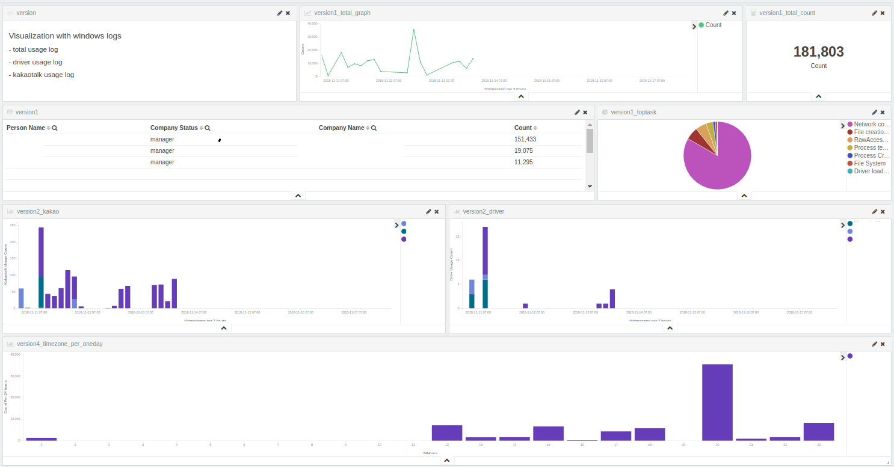

# Project: Windows Log Analysis
### used tool

-   **Sysmon :** Windows log collection
-   **Gpedit :** Windows file log collection
-   **Winlogbeat :** Send the collected logs to logstash
-   **ELK :** Mass log collection and analysis

### Project Overview

1. Use sysmon and gpedit to collect the client's window log.
2. Send the collected logs to the logstash server using winlogbeat.
3. Index the logs received from winlogbeat and send them to the elasticsearch server.
4. filter data and visualize it easily by using Kibana.

# Kibana Dashboard

### Dashboard Result 1

- total usage log
- driver usage log
- kakaotalk usage log

### Dashboard Result 2

- specific folders and files access informations

